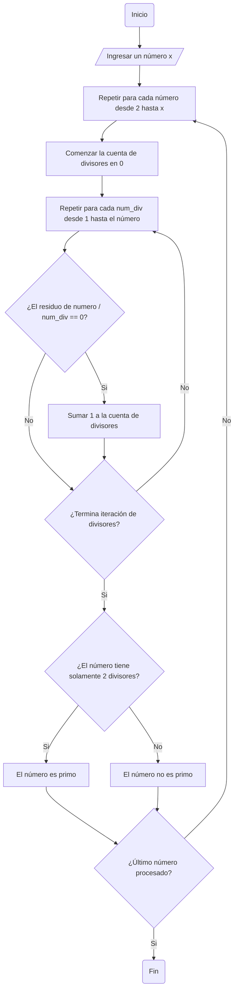

# Reto-No.3
Numeros primos hasta x numero dado.
## Pseudocodigo
Inicio  
PASO 1. Ingresar un numero x cualquiera  
PASO 2. Repetir para cada numero desde 2 hasta x  
PASO 2.1. Comenzar la cuenta de los divisores del numero en 0  
PASO 2.2. Repetir para cada num_div desde 1 hasta el numero  
PASO 2.2.1. Si el residuo del numero dividido num_div es igual a 0, num_div es divisor  
PASO 2.2.1.1. Sumar 1 a la cuenta de divisores del numero  
PASO 2.2.2. Sino, i no es divisor  
PASO 2.3. Si los divisores del numero son 2, el numero es primo  
PASO 2.4. Sino, el numero no es primo  
Fin

## Diagrma de flujo

